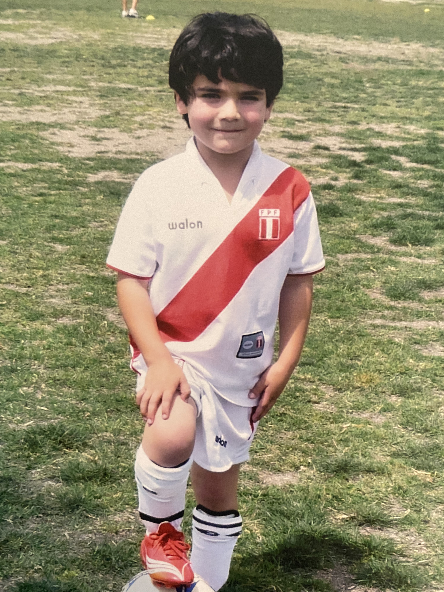

I grew up in Orange County, California, where I spent much of my time outdoors, playing sports, hiking, trail running, and at the beach. From a young age I was constantly asking questions and trying to figure out how things worked. That curiosity turned into a lasting interest in energy infrastructure and the spatial data that describes it.

I recently graduated from UC Santa Barbara with a Bachelor of Science in Environmental Science, with an emphasis in GIS and Energy & Sustainability. Most of my coursework and research was geospatial: modeling solar accessibility and transmission corridors, mapping wildfire risk, and interpolating air quality data across Northern California after the 2017 wildfires. I also contributed to research on oil well performance, green space accessibility, and rural emergency service delivery.

Most of my attention now goes to solar and battery storage. The interesting question in the U.S. is no longer whether the technology works, but how fast it can be deployed and how well it fits the places it serves. That looks different at each scale. Residential economics are tied directly to rate structure, which is why I built a solar plus storage model in Excel using NREL's PVWatts to compare bill outcomes under NEM 2.0. Utility-scale projects raise a different set of questions about siting, transmission capacity, and how the grid itself is planned and balanced. I want to work across both, and I am building the technical depth to understand these systems from the design and installation side, not just the analysis side.

What motivates me most is impact. As someone with family roots in Peru, I have seen firsthand how disparities in energy access affect quality of life and economic opportunity. In the long term I hope to contribute to projects that expand reliable, sustainable energy in underserved regions, particularly across Latin America.

Outside of work I stay active through soccer, hiking, and time outdoors. I also care about steady self-improvement, and I approach it the same way I approach energy: incremental changes compound.

------------------------------------------------------------------------

::: {layout="[1,2,1]"}

:::

------------------------------------------------------------------------
